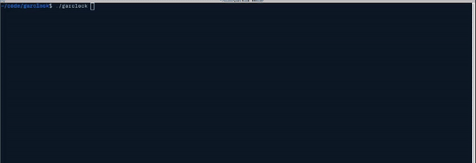

# garclock

A terminal-based clock utility. Made for a small casual competition.

## Disclaimer
This is a small project for a small competition. It is not supposed to be safe or the highest-of-quality, just show something cool.

Tested on Ubuntu 22.04 and MacOS (Mac testing done by professor Kit Cischke of Michigan Technological University). Barely tested on windows using MINGW. Hopefully it works otherwise, but I'm not going to check it :)

## Usage
Just build the only source file into an executable and run it. If you terminal isn't wide enough, the format could be all messed up.